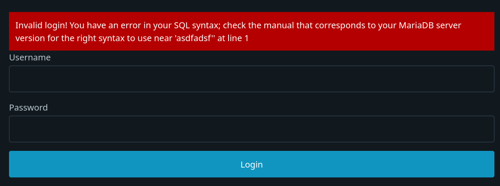

A classic vulnerability is SQL injection. This is one of a class of vulnerabilities called "injection vulnerabilities" that involve malicious user inputs being inserted into places it shouldn't be that can cause the target to so something unexpected. For SQL injection, this is for the database language SQL. SQL is a language used to query databases for data. For example, if we want all rows from the database "users" with the first name "Joe", we could use the query:

```
SELECT * FROM users WHERE first_name='Joe';
```

For a more detailed overview of SQL, you can look here: https://www.w3schools.com/sql/

## The Problem

The problem occurs when we directly place user input into these queries. Look at code in `app/login.php` page. We get the user input from a `POST` form request using the `$_POST` named array, particularly the values from `username` and `password`. Note how the variables that grab this data are directly placed into the SQL query before the query is performed with `$mysqli->query($query);`. The single quotes (`'`) are used in SQL to delimit string values, so what happens if we put a single quote into the username?

In the browser, click the "Login" button to go the login page. Put `joe'` (note the single quote) and whatever you want for the password. You should get an error like this:



This application does something bad where it prints out errors directly to the user. Applications shouldn't do this since it gives attackers (like us for the time being) more information on what's going wrong. We can see its complaining about the SQL syntax indicating that something is wrong with the query. We have injected the single quote into the query and its trying to use it to delimit a string. However, now we have an odd number of single quotes and it doesn't know what to do!

```
SELECT * FROM users WHERE username='$username' AND password='$password' 
```

turns into:

```
SELECT * FROM users WHERE username='Joe'' AND password='asdfasdf'
```

We can take advantage of this to insert extra comparisons into the query, if we put: `' OR 1=1 -- ` as the username with any password, we do a few things. First, we put a single quote to end the string, then add the comparison `1=1`. This is always true, so with the logical `OR`, the query to this point will always return true! No with ` -- `, we comment out the rest of the query, leaving only the first part of the query.

```
SELECT * FROM users WHERE username='$username' AND password='$password' 
```

turns into:

```
SELECT * FROM users WHERE username='Joe'' OR 1=1 -- ' AND password='asdfasdf'
```

If we press the login button, it lets us in with no error! If we use the "My Profile" button to view the user's profile, we can see we've logged in without a password to the account of Major Tom!

Apart from logging into other people's accounts, SQL injection can be exploited to do a number of things including:

- Look at data we are not supposed to, such as private user data or data from other tables.
- Perform data inserts and deletions (if the language and database supports multiple queries in one, MySQL/MariaDB with PHP does not sadly)
- Create files on the system (We can use this to create a backdoor!)

### Grabbing Data

We can manipulate a query to return data for us from other tables or from places not normally displayed. Click on "Users" button and go to one of the users. Then replace the value in `u=` to this:

```
' OR 2=1 UNION SELECT userid,username,password, "", "" FROM users WHERE userid=2 --%20
```

Once again, we are escaping out of a string with a single quote, but then we use the SQL `UNION` operator to add an additional query and combine the data of the query. To ensure we get the data we want, we make sure the first half fails with `2=1`, then we add another `SELECT` statement, where we can manipulate the query to order the columns in a certain way to return the password in place of the user's name. The extra `""` ensure the second query's number of columns matches that of the original query's table. With the `WHERE userid=` we can grab the cleartext password of any user which appears in the topmost title!


With just a little manipulation, we could grab table information and much more.

## The Fix

A quick and dirty fix is to simply escape all quotes. (We can do this in PHP with `str_replace("'", "\'", $variable);`, there's a commented out example in `app/page.php`) However, to be truly safe, we should use parameterized queries. Almost all DB libraries anymore have the ability to safely insert values into the query. The library will properly escape any inputs before the query is run. In PHP and MySQL, we use `->prepare()` and `->bind_param()`. Logout then lets go back to `app/login.php`. Replace the lines `$query = ...` and `$result = ` like so:

```
$stmt = $mysqli->prepare("SELECT * FROM users WHERE username=? AND password=?");
$stmt->bind_param('ss', $username, $password);
$stmt->execute();
$result = $stmt->get_result();
```

The `?` indicates we have values we will insert later, which we "bind" with `bind_param`. The `ss` indicates we are putting in 2 strings. We execute the query then get the result. You can test it still works with the user `bobby` and password `hackme` to see login still works. But now if you try to put in `joe'` as the username, it no longer causes an error. For more info on parameterized queries in PHP you can look at [here](https://www.php.net/manual/en/mysqli.quickstart.prepared-statements.php).

Using parameterized queries we can avoid directly putting user data into a query. Most injection attacks work this way, it happens when we simple append data to something without thinking of the consequences.