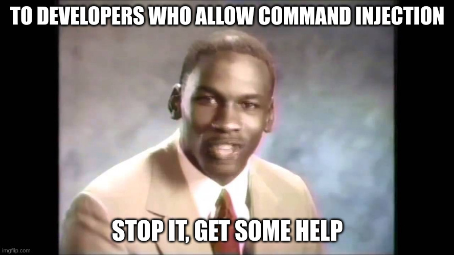
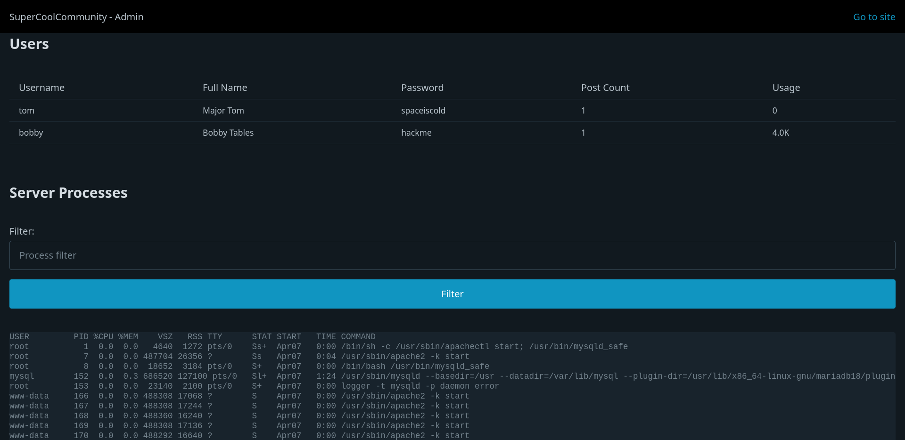
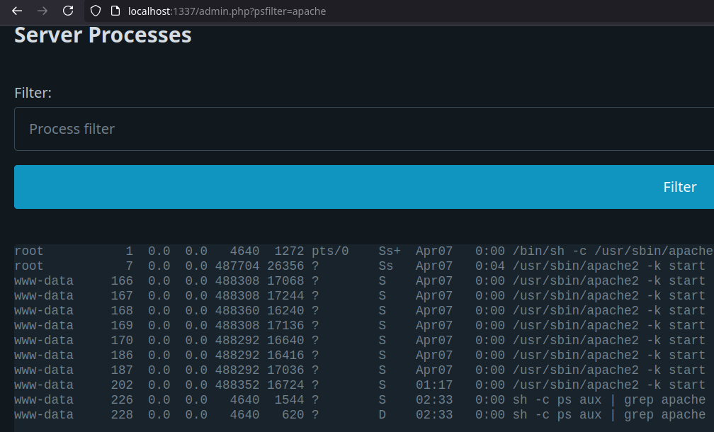
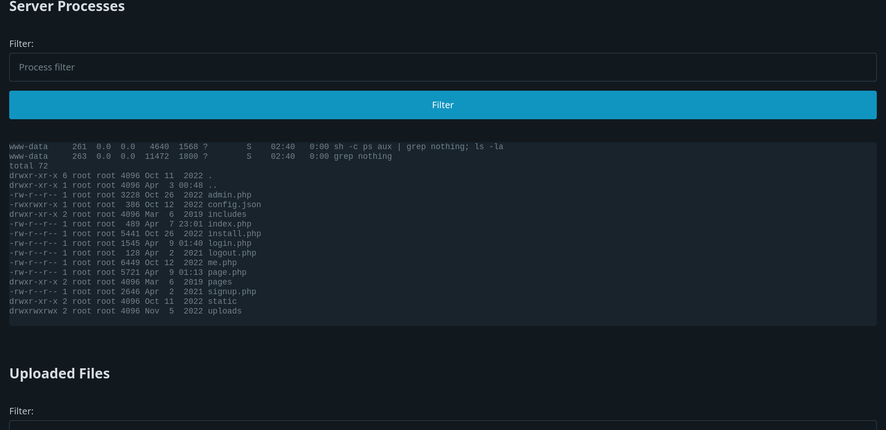

# Command Injection

Command injection is probably one of my favorites. It gives you complete control of your target and you'll (sadly) find it everywhere. Even today applications have these vulnerabilities leading to very dangerous issues.

For example:

- [CVE-2024-50603](https://www.cvedetails.com/cve/CVE-2024-50603/)
- [CVE-2024-9463](https://www.cvedetails.com/cve/CVE-2024-9463/)

I've even seen it in the field on recent devices. To those developers I'd like to say:



## The Problem

The problem here is very similar to SQL injection, instead here we put user input into calls to system commands. PHP can call system commands with `exec()`, `shell_exec()`, `proc_open()`, `system()`, and `passthru()`. If we look at `app/admin.php` we can see that we use `passthru`. You can look at `passthru`'s documentation [here](https://www.php.net/manual/en/function.passthru.php). It simply runs a command by passing its input to shell (such as `sh` or `bash`) and prints out its results. We can also see it passes data from the GET parameter `psfilter` directly.

To mess with it, lets go to the admin page, which should be at `http://localhost:1337/admin.php` or you can use the "Admin" link on the bottom of any page. Login when prompted with the username `admin` and password `admin`.



In the "Server Processes" section we can filter the names of the processes by filling in the textbox and pressing the "Filter" button. Note that this fills out our `psfilter` parameter.



Once again we are passing user data to critical function call. Since we are passing data to a shell with `passthru`, we can use shell tricks to insert commands that we want. If we use a semicolon `;`, we end the command and start a new one. Lets try putting `nothing; ls -la` as the filter.



Looks like our `ls -la` command got run. Since we put in the semicolon in, the shell treated the rest of our input as a separate command. We can do a lot with this, modifying files, executing malicious code, making a reverse shell, and so much more.

## The Fix

There are a few ways to fix this issue. We can use PHP's built-in `escapeshellarg()` or `escapeshellcmd()` functions to filter out user data. In `app/admin.php` on the line with `passthru("ps aux | grep " . $_GET['psfilter']);`, put `$_GET['psfilter']` in `escapeshellarg()`, like this:

```
passthru("ps aux | grep " . $_GET['psfilter']);
```

to

```
passthru("ps aux | grep " . escapeshellarg($_GET['psfilter']));
```

Note that if we put `nothing; ls -la` in the filter again, the extra `ls` command does not run. This is because `escapeshellarg` escapes characters like `;` and `&` to ensure they can't be used to inject commands.

My preferred way is to always reduce to the minimal required characters. In certain cases where inputs are broad, using something like `escapeshellarg` is extremely important, but in most cases, you only need a limited character set. For example, if you are putting a user ID number into a command, ensure the user ID is a number only. This is a good mindset in general to defeat injection attacks: reduce your allowed characters to a minimum for what you need. Have user names? Only allow alphanumeric characters. 

By reducing your character set to a minimum and using filtering/escaping functions like `escapeshellarg` you can avoid a lot injection attacks.