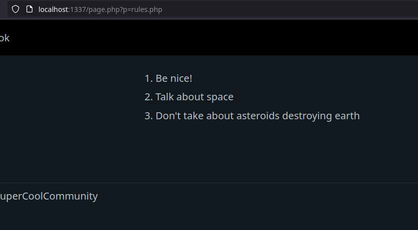
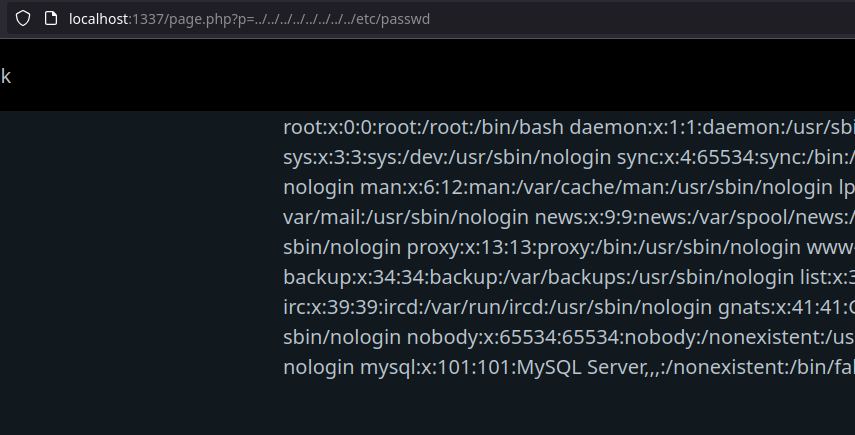
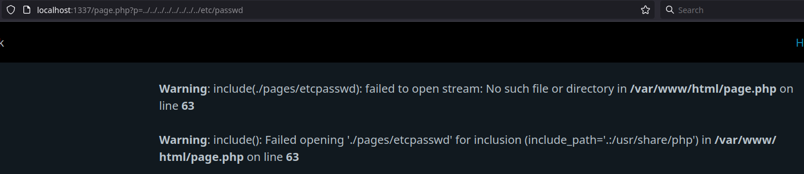
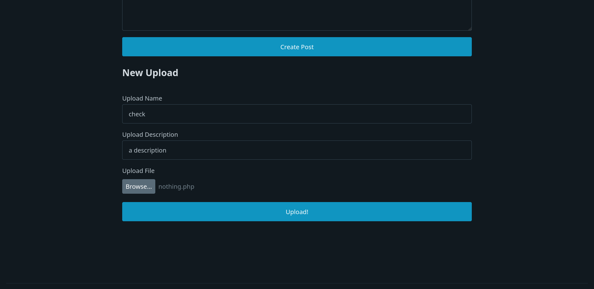
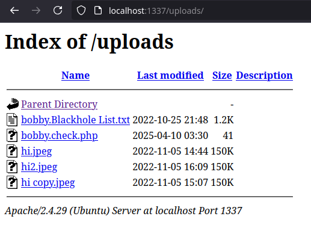
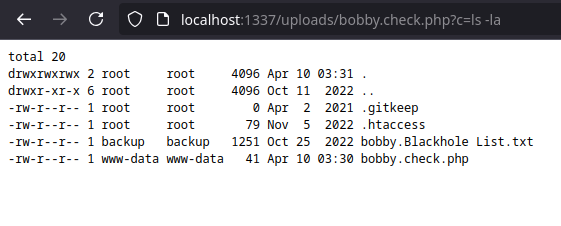

Many applications deal with files in different ways. Files can be uploaded and downloaded. Files may also be "included" into other files to incorporate the other file into another. How this is done can be exploited to put malicious files in places they shouldn't be or gain access to files we shouldn't have access to.

## Path Traversal 

One common vulnerability with files is path traversal. This basically is injecting directory changes into functions that deal with files to manipulate where files are retrieved from. If a function that deals with files (such as `include` or `fopen` in PHP) takes user input, we can utilize `../` to possibly access files outside the expected locations, including sensitive system files.

### The Problem

Let's look at `app/page.php`. Look at the line with part of the conditional being `elseif ($postname != "")`. Note that we put the variable `$postname` directly into this `include`. `include` in PHP works similar to similarly named functionality in other languages, it incorporates the included file into the current file. This allows us to reuse code. `include` in PHP also means any PHP code in the included files is run too. Here we are using it to display some pages in the web application.

In the browser, click the "Rules" button and note the URL with the `p` parameter. We are including the `rules.php` file which is in the `app/pages` directory. 



If we look further up in `app/page.php`, we see that the `$postname` variable is just the value from this parameter. This means we can utilize `../` to access files above `app/pages`. Lets trying accessing `/etc/passwd`, a sensitive system file, using a lot of `../`.



Uh oh! Since we don't filter the filename, we can include files that likely the application operators wouldn't want us to access.

### The Fix

Similar to command injection, the best tactic here is to limit allowed characters. We should probably remove any slashes from the filename and two dots `..` in a row. This can be done with the `str_replace` function to replace the offending characters. Lets make these changes:

```
include("./pages/" . $postname);
```

to 

```
include("./pages/" . str_replace("..", "", str_replace("/", "", str_replace("\\", "", $postname))));
```

For this quick fix (in production applications, you'd probably want to do more and just generally change how this whole thing works), we are removing the characters that allow us to traverse directories, primarily `..` and slashes. If we try to run our `/etc/passwd` inclusion again, it doesn't work anymore.




## Unfiltered File Uploads

File uploads are common in web applications, such as uploading documents or perhaps profile pictures. Here we're dealing with not just some user's strings, but whole files! If files are put in the wrong place, this can be very dangerous.

In `app/me.php`, look for the line with `} else if (array_key_exists('action', $_POST) && $_POST['action'] === 'upload') {`, this section details how the app manages uploads from a user. Note how we use the POST argument `name` to set the filename of the file as well as the extension of the file we upload. This is a terrible idea, and let's see why. 

Create a file with the following named `nothing.php`:

```
<pre><?php passthru($_GET['c']); ?></pre>
```

Now, in the web app, login with a user or SQL injection and go to the "My Profile" page/ Scroll down until you see "New Upload". 


Fill in the name, description, and select your `nothing.php` to upload.



Once uploaded, go to `http://localhost:1337/uploads`, it will give a directory listing. Note that a file named `<username>.<name>.php` is in here. This is our file we uploaded. I was logged in as the user `bobby` and used the name `check`. Since the file we uploaded had the extension `php`, this is what it put. 



So if we open our file with the `c` parameter set, (`<username>.<name>.php?c=ls -la`), we can execute commands with our new webshell! This is because the server considers this like any normal PHP file because of the PHP extension. Just with a single file upload, we can take control of the whole system!



> Quick side note: In certain cases, you can combine path traversal with file upload. Since you set the filename when you upload a file, if the application uses this provided filename incorrectly, you can upload files to directories you're not supposed to!

### The Problem

### The Fix

This is actually a tricky one. If we try to filter by extension, the problem is that files of certain types are not limited to their usual file extension. If we try to identify files, the problem is that files are complicated and we can even make files be two or more files at once (called polyglot files). 

For a quick (and probably incomplete fix), we can just name the with the hash of the file without giving it an extension.

Replace the line

```
$filename = $_SESSION['username'] . "." . $_POST['name'] . "." . $ext;
```

with

```
$filename = str_replace("..", "", $_SESSION['username']) . "." . hash_file('sha256', $src);
```

Here we just name the file `<username>.<hash>` with no extension. If we try to upload our webshell now, the name has no extension and no longer can be used to run commands.